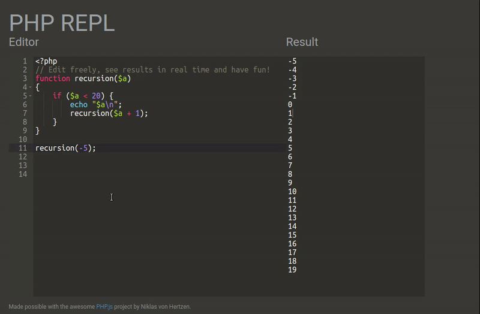

[PHP REPL](https://rsxdalv.github.io/php-repl/) is a fast sandbox for prototyping and learning core syntax in PHP. See results immediately as you type the code.

Made possible with the awesome [PHP.js](https://github.com/niklasvh/php.js) project by Niklas von Hertzen.

### Example snippets:

#### Calculation
```PHP
<?php
function recursion($a)
{
    if ($a < 20) {
        echo "$a\n";
        recursion($a + 1);
    }
}

recursion(17);
```
```
17
18
19
```

#### Hashmap
```PHP
<?php
$mapList = array('keep' => 1, 'pass' => 2, 'fortress' => 3, 'falls' => 4, 'hall' => 5, 'stadium' => 6, 'grove' => 7, 
    '1' => 'keep', '2' => 'pass', '3' => 'fortress', '4' => 'falls', '5' => 'hall', '6' => 'stadium', '7' => 'grove');

echo '$mapList.3: ';
var_dump($mapList['3']);
```
```
$mapList.3: string(8) "fortress"
```

#### Turn based validation enclosed in a class
```PHP
<?php

class Room {

    const USER_PLAYER1 = 0;
    const USER_PLAYER2 = 1;

    public $player;

    function __construct($player) {
        $this->player = $player;
    }

    public function validate($step) {
        if ($step > 6) {
            return false;
        }
        switch ($step) {
            case 1:
            case 4:
            case 5:
                if ($this->player !== self::USER_PLAYER1) {
                    return false;
                }
                break;
            case 2:
            case 3:
            case 6:
                if ($this->player !== self::USER_PLAYER2) {
                    return false;
                }
                break;
            default:
                return false;
        }
        return true;
    }
}

$x = new Room(Room::USER_PLAYER2);

$step = 3;

var_dump($x->validate($step++));
var_dump($x->validate($step++));
var_dump($x->validate($step++));

```
```
bool(true)
bool(false)
bool(false)
```